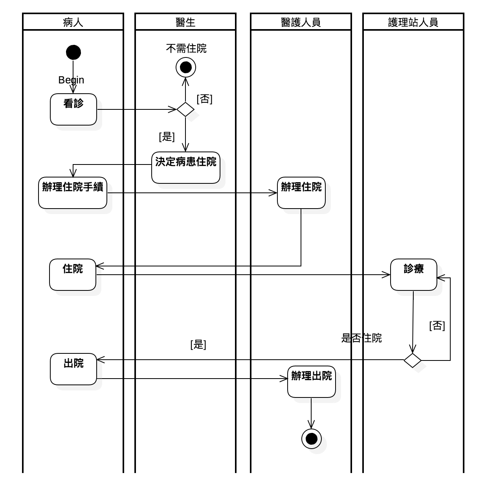
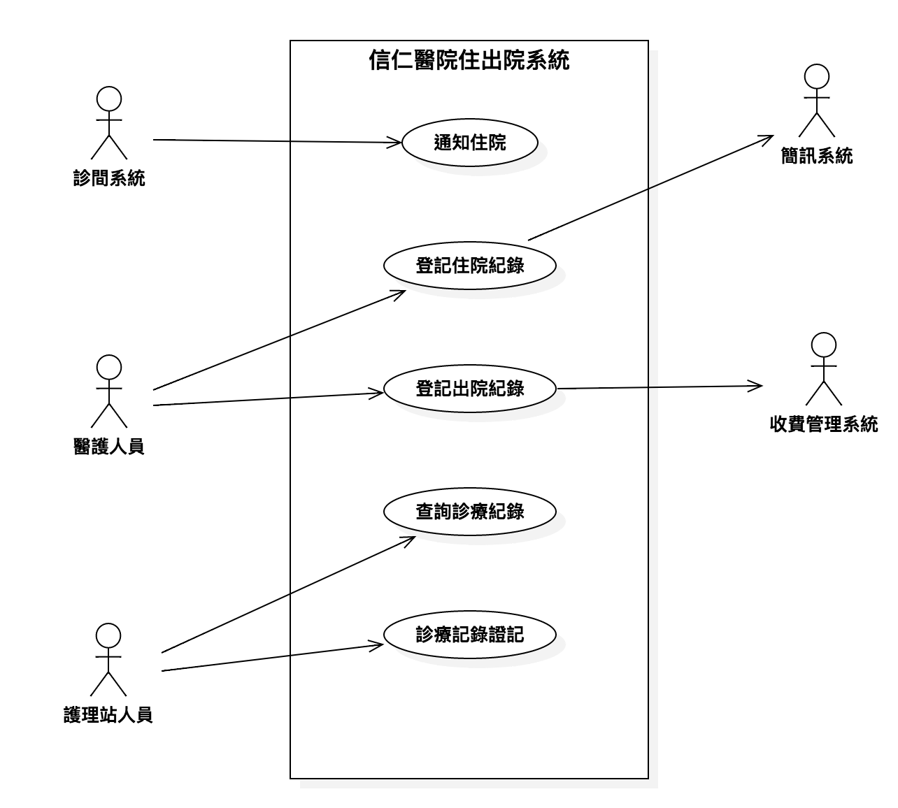
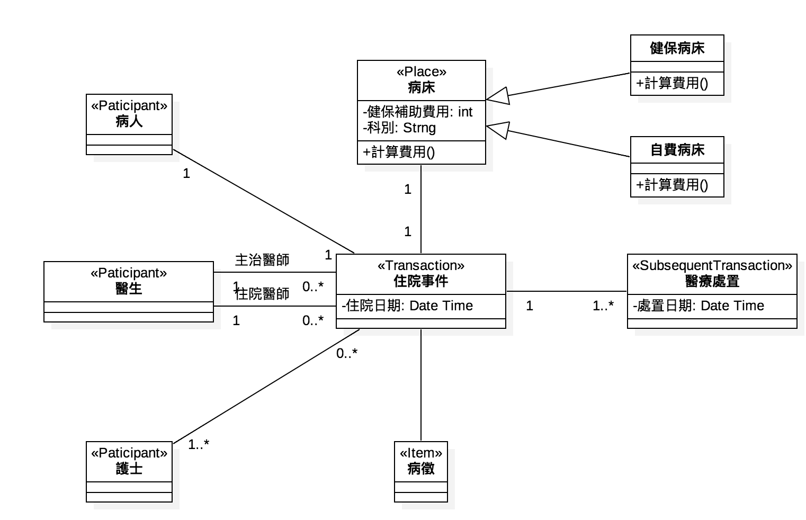

# UML
統一塑模語言(Unified Modeling Language)

[wiki](https://zh.wikipedia.org/wiki/%E7%BB%9F%E4%B8%80%E5%BB%BA%E6%A8%A1%E8%AF%AD%E8%A8%80)

## 結構性圖形（Structure diagrams）
強調的是系統式的塑模：

* 靜態圖（static diagram）
* 類別圖（Class Diagram）
* 物件圖（Object diagram）
* 套件圖（Package diagram）
* 實現圖（implementation diagram）
* 組件圖（Component diagram）
* 部署圖（Deployment diagram）
* 剖面圖（Profile diagram）
* 複合結構圖（en:Composite structure diagram）

## 行為式圖形（Behavior diagrams）
強調系統模型中觸發的事件：

* 活動圖（Activity diagram）
* 狀態圖（State Machine diagram）
* 使用個案圖（Use Case Diagram）

## 交互性圖形（Interaction diagrams）
屬於行為圖形的子集合，強調系統模型中的資料流程：

* 通信圖（Communication diagram）
* 交互概述圖（Interaction overview diagram，UML 2.0）
* 時序圖（Sequence diagram，UML 2.0）
* 時間圖（Timing Diagram，UML 2.0）

## 範例介紹
[UML團隊開發流程與管理](http://www.books.com.tw/products/0010513353)

### 活動圖
使用在描述企業的本質性的工作流程。

#### 信仁醫院住出院流程

### 使用案例圖
主要陳述系統是如何滿足特定參與者的某些期望。

#### 信仁醫院住出院系統使用案例圖

### 類別圖

#### 概念模型
「概念模型」的原始定義是表達問題領域中的抽象概念，本質上應著重於解決問題的「核心」。一般來說即是「事務流程」的抽象化呈現，以軟體結構面來看，指的就是你要解決問題中的重要概念在抽象層次的呈現。通常會透過「概念模型」(conceptual model)，來表示。如何找出概念模型? 不外乎從「人、事、時、地、物」之間的關係來建構。

#### 領域模型
